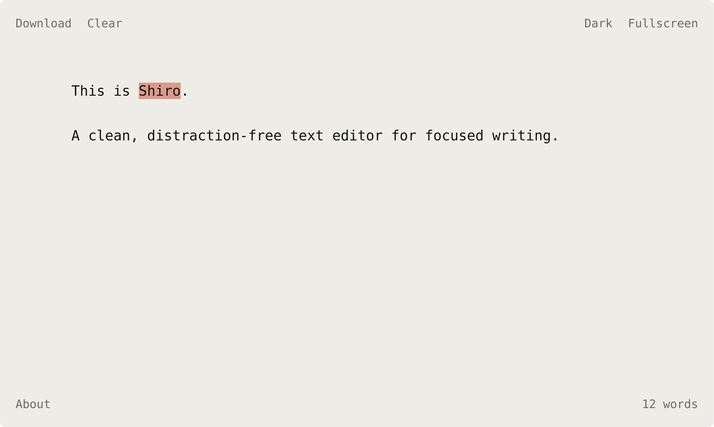

# Shiro「白」

A clean, distraction-free text editor for the web.

  
  <a href="https://vsakkas.github.io/shiro/"><b><i>Start writing</i></b></a>

## Features

- **Focus on your writing** – The interface fades away as you type.
- **Comfort for your eyes** – Light and dark themes for any time of day.
- **Never lose your work** – Auto-save in your browser.
- **Know your progress** – Built-in word and character count.
- **Take your words with you** – Export locally anytime.
- **Go all in** – Full-screen mode.
- **Respects your privacy** – No accounts, no tracking, no cookies.

## License

This project is licensed under the MIT License – see the [LICENSE](LICENSE) file for details.
